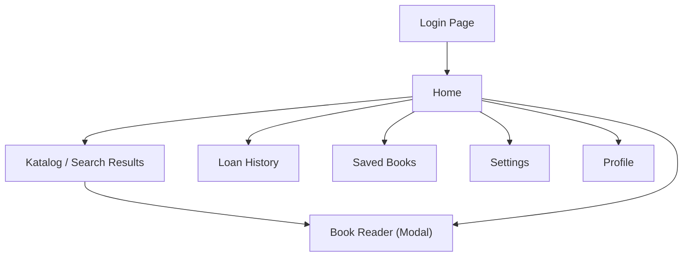

# 📐 Wireframe — Open Library Telkom University

Dokumen ini berisi wireframe untuk seluruh halaman utama website Open Library (redesign).

---

## 1. Halaman Login

Halaman pertama yang dilihat user. Layout split-screen: banner kiri (branding) + form login kanan.

**Komponen:**
- Logo & branding Telkom University  
- Heading "Discover a world of limitless knowledge"
- Avatar row (10,000+ Active Students)
- Form: Email, Password, Remember me, Forgot password
- CTA: "Sign In to Dashboard"

---

## 2. Halaman Home (Desktop)

Halaman utama setelah login. Menampilkan semua section utama perpustakaan.

**Komponen:**
- **Header**: Logo, Search bar (Alt+K), Advanced search, Notification bell, User avatar
- **Sidebar** (kiri): Logo Tel-U, Theme toggle, Nav icons (Home, Katalog, Riwayat, Disimpan, Setelan), Logout
- **Hero Section**: Badge "Official eLibrary Hub", Heading besar, CTA "Start Discovering", E-Books/Journals pills, Stats row
- **Category Filter**: Horizontal pills (All, Fantasy, Finance, Leadership, Journals, Business)
- **New Arrivals**: Carousel buku terbaru dengan badge "Latest"
- **Top Picks**: Carousel buku rekomendasi IMK/HCI dengan badge "Rekomendasi"
- **Digital Library Vault**: Grid 4 kolom (IEEE, Springer, ProQuest, ScienceDirect)

---

## 3. Halaman Katalog / Search Results

Halaman pencarian dan filter buku perpustakaan.

**Komponen:**
- **Filter Sidebar** (kiri):
  - Publication Year (2024, 2023, 2022, 2021, 2020 & Older)
  - Program Studi (Informatics, IS, Business, Creative Industries, Engineering)
  - Format (Buku, Jurnal, Skripsi)
- **Results Area** (kanan):
  - "Library Catalogue" heading + jumlah hasil
  - Card list: Cover thumbnail, format badge, judul, author, status (Available/Borrowed), abstract, action buttons (View Details, Bookmark, External Link)

---

## 4. Halaman Profil Mahasiswa

Dashboard profil mahasiswa dengan statistik perpustakaan.

**Komponen:**
- **Digital ID Card**: Avatar, nama, jurusan, NIM + QR code
- **Contact Info**: Email, Phone, Campus Location
- **Stats Grid** (4 kolom): Books Read (42), Currently Borrowed (2), Overdue (0), Reader Rank (Top 5%)
- **Recent Activity**: List aktivitas (Borrowed, Returned, Reserved, Paid Fine) dengan tanggal

---

## 5. Mobile Views

Tampilan responsif untuk perangkat mobile. Sidebar diganti **bottom navigation bar**.

**Fitur Mobile:**
- Header kompak (logo + search + bell + avatar)
- Hero section dengan font lebih kecil, CTA stack vertikal
- Book carousel: cover lebih pendek, 1.5 slide terlihat
- Bottom nav bar: Home, Katalog, Riwayat, Disimpan, Setelan, Theme toggle
- Filter sidebar collapsible di halaman katalog
- Card layout full-width

---

## Sitemap

## Color System

| Token | Light Mode | Dark Mode |
|-------|-----------|-----------|
| Background | `#FDFBF3` (Cream) | `#1e1e20` (Dark Gray) |
| Primary | `#8B0000` (Crimson) | `#c0392b` (Soft Red) |
| Card | `#ffffff` | `#26262a` |
| Border | `#E8E6D9` | `#35353a` |
| Foreground | `#252422` | `#e8e6e1` |
